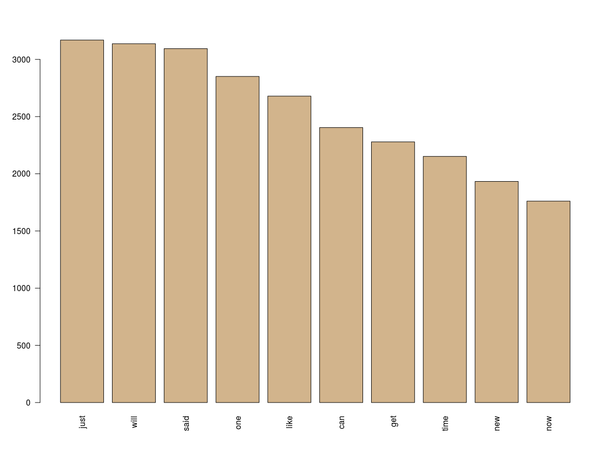
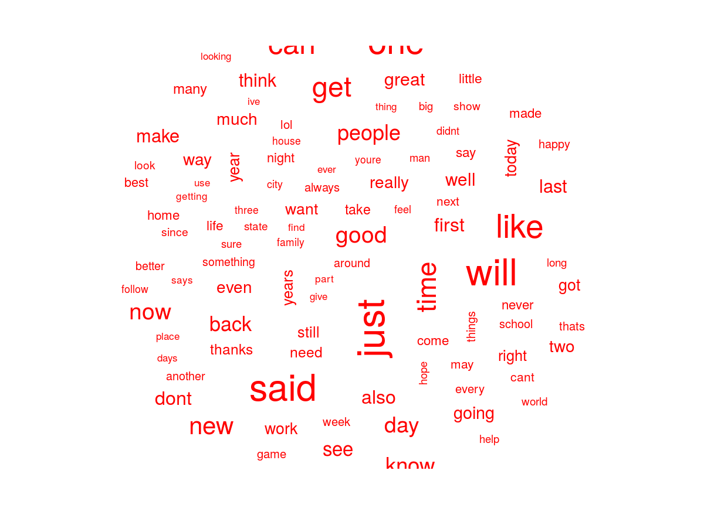
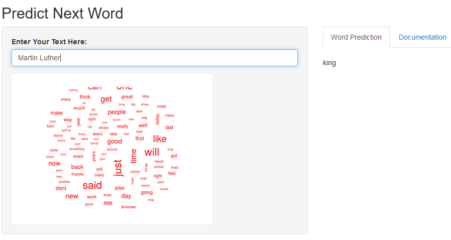

```{r setup, include=FALSE}
knitr::opts_chunk$set(echo = FALSE)
```

## Summary

**Welcome to Next Word Prediction Application:**

This shiny application is a prototype implementation of a statistical language model that lets you predict your next word as you are typing on your keyboard. 

I built this prediction language model using text data sources from Twitter, News and Blogs. I sampled a smaller set of the input data to train the model and a separate sampled dataset was used to test the model accuracy.

**Links**

Click at the link given below to try the application hosted on the shiny server:

https://predictive-intelligence.shinyapps.io/PredictNextWord_v04/

Github Repository for complete code:

https://github.com/HassanAhmed2020/NLP_TextMining


## Exploratory Analysis

For exploratory analysis, I used the same sample data that I used for building the n-gram model. I created the Data_Sample.txt file, by sampling and combining all three input data files. 

As we can see from the word cloud and from bar chart that most frequently used words in the dataset were "Just" and "Said". 

{  width=45% }
{ width=50% }


## Modeling

**Model:** I used Stupid Backoff ngram model to predict the next word. I created a sample data set of smaller size using the originally provided three data files. This smaller sample data Set was used for my model training.

**N-Gram Size:** I then created 1, 2, 3 and  4-grams tokens to build the predictive model. In this model the algorithm takes an input sentence and extracts the last 3 words. It first tries to match these 3 words with the 4-gram model. If the match is successful, it returns the matching highest frequency word. If the match is not found in 4-gram model, the algorithm will try to find match in 3 and 2-gram models. Finally if there is no match found, the algorithm use the 1-gram model to return the word with the highest frequency.

**Accuracy:** The algorithm was able to achieve about 13% to 16% accuracy when tested with test data set. This accuracy is low and can be improved by using more complicated algorithms.

**Algorithm Improvement:** I have kept the Algorithm  very simple and only used the highest matched N-gram for prediction at a time. For improvement, I will be implementing scoring using alpha multipliers to implement true "Stupid Backoff" model.


## How The Language Model is Built

I used so called ``Stupid Backoff`` n-gram Language Model to predict the next word. I used the ``Stupid Backoff`` algorithm in very simple manner to improve speed and minimize complexity. I used only one ngram model at a time to predict the next word; starting with the highest n-gram model and moving to lower-ngram models if no match is found in the highest n-gram model.

I created a sample data set of smaller size using the originally provided three data files. This smaller sample data Set was used for my model training.


Following steps describes how the language is built:


1. **Load Data:** Load original data files and create a smaller sampled dataset to be used for modeling (look ``CreateSampleData.R`` for details)

2. **Exploratory Analysis:** Do data exploratory analysis to look at most common words and any other data features (look at ``DataPrepAndExplore.R`` (This R script calculates top-words-frequency, wordcloud, a hierarchical model of terms, calculate association between terms))

3.   **Create N-Grams** Take text data sample file created in the previous steps and creates 1,2,3 and 4-grams tokens of all the words in the text file. 
    + Create Corpse: Corpse is a collection of documents. Created corpse using the sample data
    + Clean Corpse: Clean up corpse with punctuations, numbers, profanity and converted all words to lower case.
    + Create n-grams TDM tokens: Created 1,2,3 and 4-gram tokens TDM (Term Document Matrix) using cleaned up corpse.
    + Calculate Frequencies: Next we calculated frequencies of each token and sorted them by highest frequency first. As sorting will help us predict the term with the highest frequency.
    + Next we split tokens into individual words for that we can use 1st, 2nd and 3rd words in an N-Gram to match with input sentences. Look at ``ngrams-build.R`` file for details.

4. **implement Stupid Backoff** Create a function to predict next word using the n-grams created in the previous steps. I created a function called ``predictWord`` to implement ``Stupid Backoff`` n-gram algorithm to predict the next word by using 4,3,2 and 1-gram models in that order. This function takes an input sentence and extracts n-1 words from that sentence. It starts with the highest n-gram model and try to do a match. If no match is found then it looks for n-2 ngram model for a match. If no match is found in any of the n-gram model then the algorithm shows the highest frequency word from 1-gram model.

5. **Shiny App** Finally I created shiny app which allows to input a sentence and shows predicted outcome. This shiny app loads the ngrams and the ``predictWord`` function created in the previous steps using an Rdata file. Shinyapp ``server.R`` used the predictWord function within a reactive function to predict next word based on the input sentence provided by the ``ui.R``. 

6. **Testing Accuracy** For testing model's accuracy, I created a new sample dataset and used ``Accuracy_ngrams-build.R`` R script to create ngrams to be used for testing the model. These ngrams are saved in ``Accuracy_ngrams.Rdata`` file. I created ``TestAccuracy.R`` script, this R script test model's accuracy using the accuracy n-grams craeted by ``Accuracy_ngrams-build.R`` script. I used predictWord function to see if it can randomly predict 1,2,3,4 ngrams from ``Accuracy_ngrams.Rdata``.


## Shiny Application

I created shiny app which allows user to input a sentence and shows predicted outcome. App is hosted on ``shinyapps.io``. App can be accessed via clicking on following link:

https://predictive-intelligence.shinyapps.io/PredictNextWord_v04/

This shiny app include following files:

* ui.R
* server.R
* predictWord.Rdata

This shiny app loads the 1,2,3 and 4 ngrams and the ``predictWord`` function created in the previous steps using predictWord.Rdat file. Shinyapp ``server.R`` used the predictWord function within a reactive function to predict next word based on the input sentence provided by the ``ui.R``. Due to large size of Ngrams datasets, the App takes 15 seconds in loading before it can start making the predictions.

{ width=50% }


## Appendix

#### Various Components, R Scripts and Data Files:

##### Input Data Files:

    - en_US.blogs.txt (Text File containing misc blog items)
    - en_US.news.txt (Text File containing misc news items)
    - en_US.twitter.txt (Text File containing misc twitter tweets)
    - englishBadWords.txt (Text file containing inappropriate words to be filtered out from the dataset)

##### Sample Datafile Creation:

    - CreateSampleData.R (This R script creates a smaller sample dataset from original datasets)
    - Data_Sample.txt (This is smaller sampled output data file to be used for train and build the model)
    - Data_Sample_Accuracy.txt (This is smaller sampled output data file to be used for testing model accuracy)

##### Data Exploration and Preparation:

    - DataPrepAndExplore.R (This R script calculates top-words-frequncy, wordcloud, a hierarchical model of terms, calculate association between terms)

##### N-gram Language Model Building:

    - ngrams-build.R (This R script takes text data file and creates 1,2,3 and 4-grams tokens of all the words in the text file)
    - ngrams.Rdata (This Rdata file cotains output of ngrams-build.R script. Four dataframes containing 1,2,3 and 4 ngrams)
    - predictWord.R (This R script creates a function "predictWord" , this function uses ngrams and predict netxt word)
    - predictWord.Rdata (This Rdata file contains the function and ngram dataframe needed for predictword to work)

##### Testing Model Accuracy:

    - Accuracy_ngrams-build.R (This R script creates ngrams to be used for testing the model)
    - Accuracy_ngrams.Rdata (This Rdata files contans Dataframes created by previous R script)
    - TestAccuracy.R (This R script test model's accuracy using the accuracy n-grams craeted by Accuracy script and the predictWord function)

##### Shiny Application:

    - ui.R (Shiny Application UI script)
    - server.R (Shiny Application Server script)
    - ./www/WordCloud.png (Wordcloud images used by the Shiny Application)


